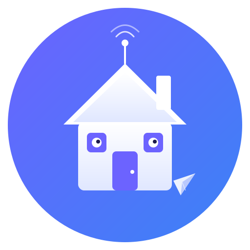

<p align="center">
  
</p>

<h1 align="center">Homeboy</h1>

Control a fully functional computer with AI from your phone.

Install any Software/CLI you need and the bot could run it for you — remotely, conversationally, instantly or scheduled, no limits.

A personal AI assistant that lives in Telegram, powered by the [Claude Agent SDK](https://docs.anthropic.com/en/docs/claude-agent-sdk). It gives Claude full access to your machine — bash, filesystem, network, and custom tools — through a conversational Telegram interface.

## Features

- **Full machine access** — Claude can run commands, read/write files, browse the web, and more
- **Persistent conversations** — sessions are saved and resumed automatically
- **Photo analysis** — send photos for Claude to analyze via vision
- **Scheduled tasks** — schedule one-time or recurring tasks in natural language (e.g. "check disk usage every 6 hours")
- **File sharing** — Claude can send you files, screenshots, and generated output directly in chat
- **Model switching** — swap between Claude models at runtime
- **Single-user auth** — only your Telegram account can interact with the bot

## Prerequisites

- Node.js 20+
- A [Telegram bot token](https://core.telegram.org/bots#how-do-i-create-a-bot) from @BotFather
- An [Anthropic API key](https://console.anthropic.com/) (set as `ANTHROPIC_API_KEY` in your environment)

## Setup

```bash
git clone https://github.com/MatanOligo/homeboy.git
cd homeboy
npm install
```

Copy the example config and fill in your values:

```bash
cp .env.example .env
```

Edit `.env`:

| Variable | Description |
|---|---|
| `TELEGRAM_BOT_TOKEN` | Bot token from @BotFather |
| `ALLOWED_USER_ID` | Your Telegram user ID (get it from @userinfobot) |
| `CLAUDE_MODEL` | Claude model to use (default: `claude-sonnet-4-6`) |
| `WORKING_DIR` | Directory where Claude executes commands (default: `.`) |
| `MAX_MESSAGE_AGE` | Seconds before stale messages are dropped (default: `60`) |

You also need `ANTHROPIC_API_KEY` set in your environment (or add it to `.env`).

## Running

```bash
# Development (auto-reload on changes)
npm run dev

# Production
npm start
```

### Systemd (optional)

A sample systemd service file is included at `homeboy.service`. Edit the paths to match your setup, then:

```bash
sudo cp homeboy.service /etc/systemd/system/
sudo systemctl daemon-reload
sudo systemctl enable --now homeboy
```

The bot auto-restarts on crashes. View logs with `journalctl -u homeboy -f`.

## Commands

| Command | Description |
|---|---|
| `/new` | Start a fresh conversation |
| `/schedule <desc>` | Schedule a task in natural language |
| `/tasks` | List all scheduled tasks |
| `/cancel <id>` | Cancel a scheduled task |
| `/model [name]` | View or switch Claude model |
| `/status` | Bot status, uptime, session info |
| `/log [n]` | Show recent log entries |
| `/restart` | Restart the bot |
| `/help` | List all commands |

Any non-command text is sent directly to Claude. Photos are analyzed via Claude's vision.

You can also schedule tasks conversationally — just say "check disk usage every 6 hours" in chat.

## Architecture

```
src/
  index.ts        Entry point, boot sequence, signal handling
  bot.ts          Telegram bot, commands, message handlers
  assistant.ts    Claude Agent SDK wrapper, session management
  tools.ts        Custom MCP tools (schedule_task, list_tasks, cancel_task)
  config.ts       Typed env config, system prompt loading
  db.ts           SQLite database for scheduled tasks
  scheduler.ts    Task scheduler loop, runs tasks in isolated sessions
  logger.ts       File + console logger
  utils.ts        Message chunking, typing indicator, file sending
```

- **Sessions** are persisted in `data/sessions.json` and resumed automatically
- **Scheduled tasks** are stored in `data/homeboy.db` (SQLite)
- **Logs** go to `data/homeboy.log` and stdout
- **Outbox** — Claude saves files to `data/outbox/`, which are automatically sent to you and deleted

## Customization

Edit `system-prompt.txt` to change the AI's personality and instructions. The `{{OUTBOX_DIR}}` placeholder is replaced at runtime with the actual outbox path — no need to hardcode it.

## Security

This bot gives Claude **full access to your machine** with no sandboxing. It is designed for personal use on a trusted machine. Only messages from your `ALLOWED_USER_ID` are processed; all others are silently ignored.

Do not expose this bot to untrusted users.

## License

[MIT](LICENSE)
